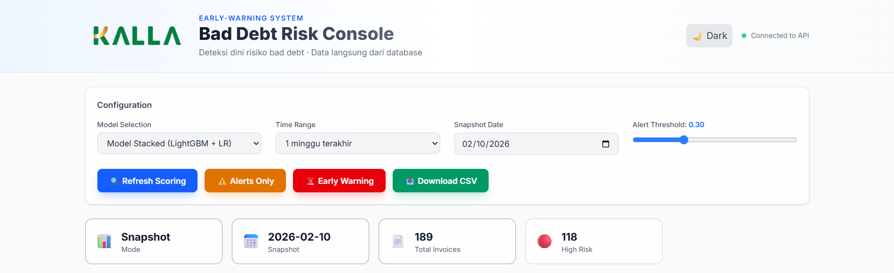
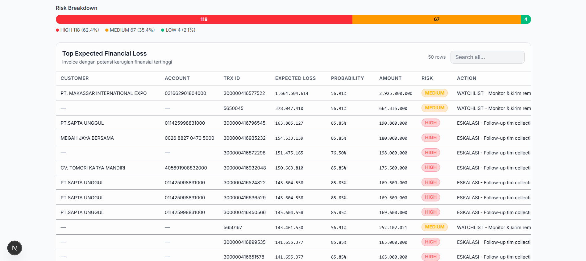
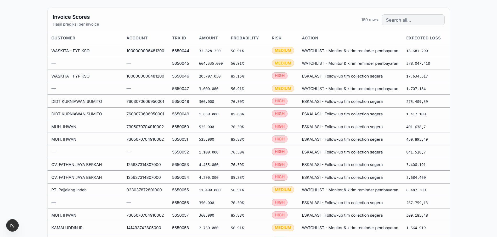
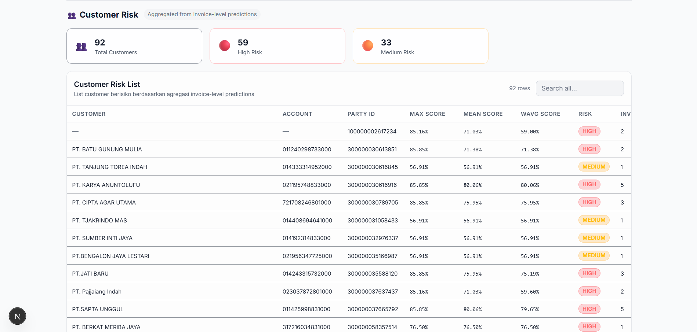

# Bad Debt Risk Console (Frontend)

Dashboard interaktif berbasis **Next.js 15 (App Router)** yang dirancang untuk memonitor, menganalisis, dan memprediksi risiko _bad debt_ secara _real-time_ atau berdasarkan data historis.

## 🚀 Fitur Dashboard

- **Konfigurasi Dinamis**: Memilih model ML (Stacked/LightGBM) dan tingkat ambang batas (_alert threshold_) secara langsung.
- **Dual Date Filtering**:
  - **Quick Select**: Pilihan cepat 1 minggu, 1 bulan, hingga 1 tahun terakhir.
  - **Rentang Kustom (Custom Range)**: Input kalender "Dari - Ke" untuk analisis periode spesifik.
- **Validasi Terikat Database**: Kalender secara otomatis membatasi pilihan tanggal (min/max) berdasarkan ketersediaan data riil di database pusat.
- **Export Data**: Fitur unduh hasil analisis ke format CSV untuk pelaporan lebih lanjut.
- **Dark Mode Support**: Antarmuka modern dengan dukungan mode gelap/terang demi kenyamanan pengguna.

## Visual Interface






## 🛠️ Instalasi dan Menjalankan

### Prasyarat

- **Node.js 18.x** atau versi terbaru.
- **FastAPI Backend** (Pastikan API sudah berjalan di port 8000).

### Langkah-langkah

1. **Masuk ke direktori proyek:**

   ```bash
   cd (tergantung di folder mana)
   ```

2. **Install dependencies:**
   Gunakan _package manager_ pilihan Anda (npm, yarn, pnpm, atau bun):

   ```bash
   npm install
   # atau: yarn install | pnpm install | bun install
   ```

3. **Konfigurasi Environment (Direkomendasikan/Opsional):**
   Secara _default_ aplikasi akan mengarah ke `http://localhost:8000`. Jika menggunakan host/port lain, buat file `.env.local` di direktori utama:

   ```env
   NEXT_PUBLIC_API_BASE=http://localhost:8000
   ```

4. **Jalankan Development Server:**
   ```bash
   npm run dev
   # atau: yarn dev | pnpm dev | bun dev
   ```

Akses dashboard melalui _browser_ di: [http://localhost:3000](http://localhost:3000)

## 📂 Struktur Proyek

```text
web-next/
├── src/
│   ├── app/                    # Next.js App Router
│   │   ├── page.tsx            # Komponen Utama Dashboard & State Management
│   │   ├── layout.tsx          # Root Layout (Font & HTML Shell)
│   │   └── globals.css         # Styling Global (Tailwind base)
│   ├── components/ui/          # Kompnonen UI Reusable
│   │   ├── StatCard.tsx        # Widget Ringkasan Angka (Total Score, Alerts)
│   │   ├── RiskBar.tsx         # Visualisasi Progress-bar Risiko
│   │   └── DataTable.tsx       # Tabel Interaktif dengan Sort & Filter
│   ├── lib/                    # Utilitas & Helper
│   └── types/                  # Definisi Type TypeScript (ScoringResult, TimeRange)
├── public/                     # Aset Gambar & Ikon
├── tailwind.config.ts          # Konfigurasi Styling
└── next.config.ts              # Konfigurasi Next.js
```

### Penjelasan Komponen Utama:

#### 1. `src/app/page.tsx`

Pusat logika dashboard. Menangani:

- **State Management**: Mengelola pilihan model, threshold, rentang waktu, dan data hasil prediksi.
- **API Orchestration**: Mengambil metadata dari `/models` dan memicu scoring ulang setiap kali konfigurasi berubah.
- **Conditional UI**: Merender filter kalender kustom hanya ketika opsi "Rentang Kustom" dipilih.

#### 2. `src/components/ui/DataTable.tsx`

Komponen tabel pintar yang mendukung:

- Pencarian data berdasarkan nama atau nomor invoice.
- _Tagging_ otomatis level risiko (High, Medium, Low) dengan warna yang kontras.
- Integrasi data EFL (Estimated Financial Loss).

#### 3. State-Bound Calendars

Seluruh elemen `<input type="date" />` di dashboard ini memiliki atribut `min` dan `max` yang diambil secara dinamis dari API. Hal ini menjamin pengguna tidak melakukan _query_ pada rentang tanggal yang datanya tidak tersedia di database.

---

_Dikembangkan untuk tim Internal Kalla - Bad Debt Early-Warning System._
